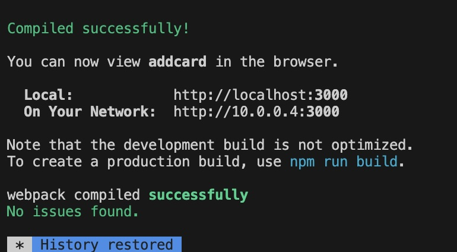
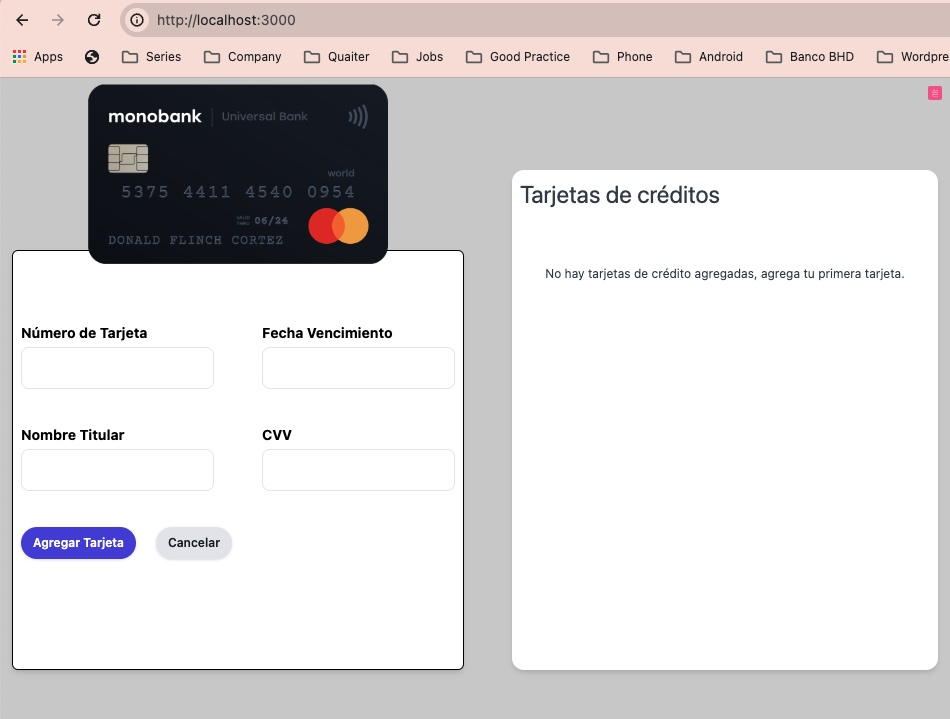

# Brief description

This app was build in order to show case knowlege using frotend (ReactJS) and backend tehcnologies. (.net Core)

# How to Install

This project depens on , go to [sii-challange-backend](https://github.com/delciopolanco/sii-challange-backend)

After sucessfully installing the backend, and cloning this project, then run in a terminal:

- `npm i`
- `npm start`

it should look like this:

then your project on localhost:3000

Dev environment is specified in `.env` file

# Extending the app.

In case you want to add another translation for this app, you can modify the `i18n.js` under `src/` folder. The Default language is es (Espanish).
